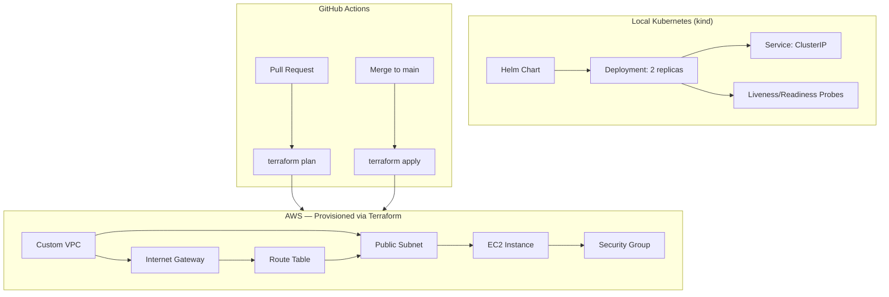

# platform-service — K8s + Terraform Mini-Platform

A small FastAPI service deployed to a local Kubernetes cluster via Helm, with all AWS infrastructure (VPC, subnet, EC2) provisioned entirely as code through Terraform — including a full CI/CD pipeline for infrastructure changes.

---

## What This Project Demonstrates

- **Kubernetes fundamentals** — Deployments, Services, health probes, rolling updates, self-healing
- **Helm** — packaging Kubernetes manifests into a reusable, versioned chart
- **Terraform** — provisioning a complete custom VPC, subnet, internet gateway, route table, security group, and EC2 instance as code
- **Remote state management** — S3 backend + DynamoDB locking for safe, shared Terraform state
- **GitOps-style CI/CD** — `terraform plan` runs automatically on every PR, `terraform apply` runs automatically on merge to `main`
- **Reproducibility** — proven by fully destroying and rebuilding all 8 AWS resources from code alone

---

## Architecture



---

## Tech Stack

| Layer | Technology |
|---|---|
| App | FastAPI (Python) |
| Containerization | Docker (multi-stage build) |
| Orchestration | Kubernetes (via `kind`) |
| Packaging | Helm |
| Infrastructure as Code | Terraform |
| State Backend | AWS S3 + DynamoDB |
| CI/CD | GitHub Actions |
| Cloud | AWS (VPC, EC2) |

---

## Key Features

- **Health probes** — liveness and readiness checks on `/health`, verified by simulating pod failure and scale-to-zero/back-up tests
- **Rolling updates with proper image tagging** — versioned tags (`1.0`, `1.1`) instead of `:latest`, enabling reliable `kubectl rollout undo`
- **Custom VPC networking** — not relying on AWS's default VPC; public subnet, internet gateway, and route table all defined explicitly
- **Remote Terraform state** — stored in S3 with DynamoDB locking, the same pattern used by real engineering teams
- **Automated plan/apply gate** — infrastructure changes are reviewed via `plan` on every PR before being allowed to `apply` on merge

---

## Local Setup

### Kubernetes (kind + Helm)
```bash
kind create cluster --name pr-roaster-cluster
docker build -t platform-service:1.1 .
kind load docker-image platform-service:1.1 --name pr-roaster-cluster
helm install platform-release ./platform-chart
kubectl port-forward service/platform-release-platform-chart 8080:80
```

### Terraform (AWS infrastructure)
```bash
cd terraform
terraform init
terraform plan
terraform apply
```

---

## CI/CD Pipeline

`.github/workflows/infra.yml` triggers on any change inside `terraform/`:

- **On Pull Request** → `terraform fmt -check`, `validate`, `plan` (read-only preview, no changes applied)
- **On merge to `main`** → `terraform apply -auto-approve` (infrastructure changes go live)

This enforces that every infrastructure change is reviewed via PR before it can affect real AWS resources.

---

## What I Learned

- How Kubernetes Deployments maintain desired state — proven by scaling to 0 and back, watching pods self-heal
- Why `:latest` image tags break reliable rollback, and how to fix it with versioned tags
- Setting up Terraform remote state with S3 + DynamoDB locking
- Migrating existing AWS resources (EC2) into a newly created custom VPC
- Building a GitOps-style CI/CD gate: plan on PR, apply on merge

---

## Author

**Shazna Muees**
Software Engineer
[GitHub](https://github.com/shaznamuees1-dev) · [LinkedIn](https://www.linkedin.com/in/shaznamuees/)
